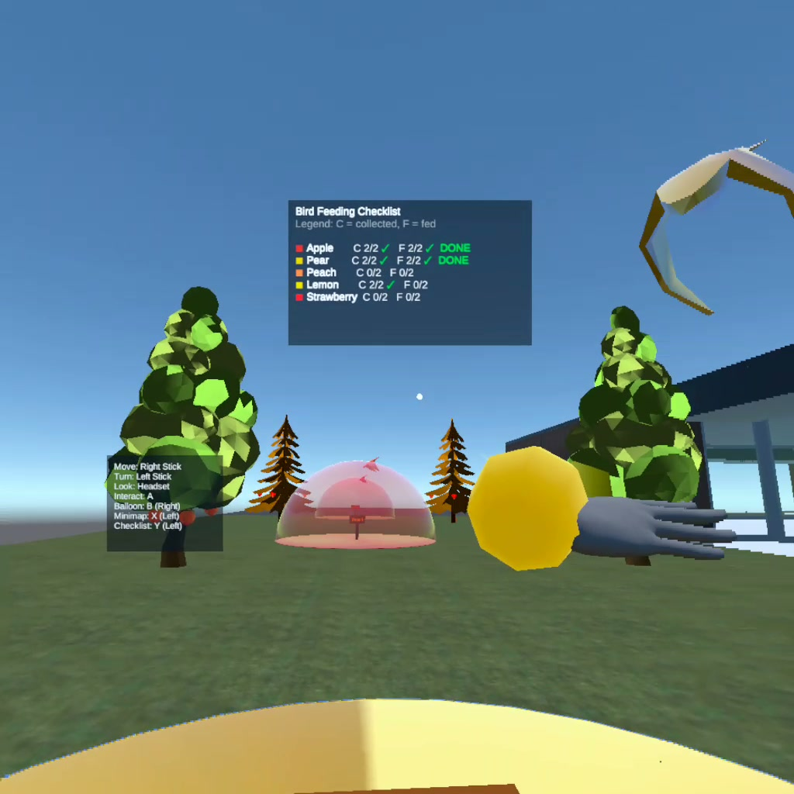
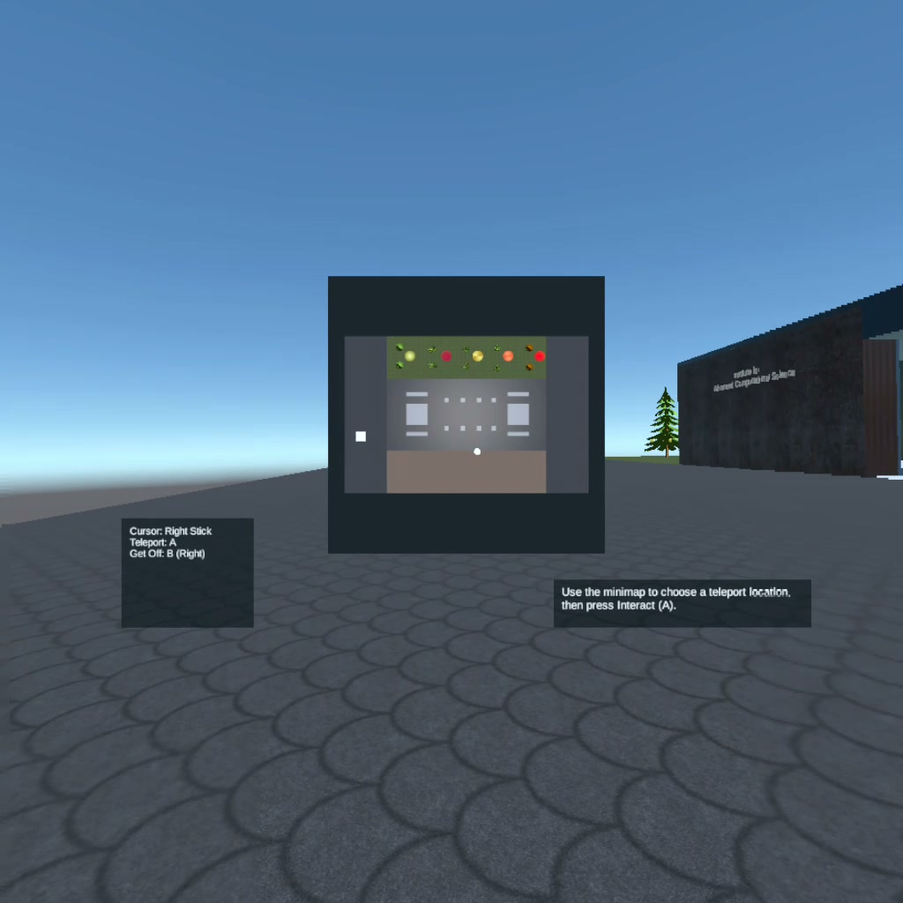
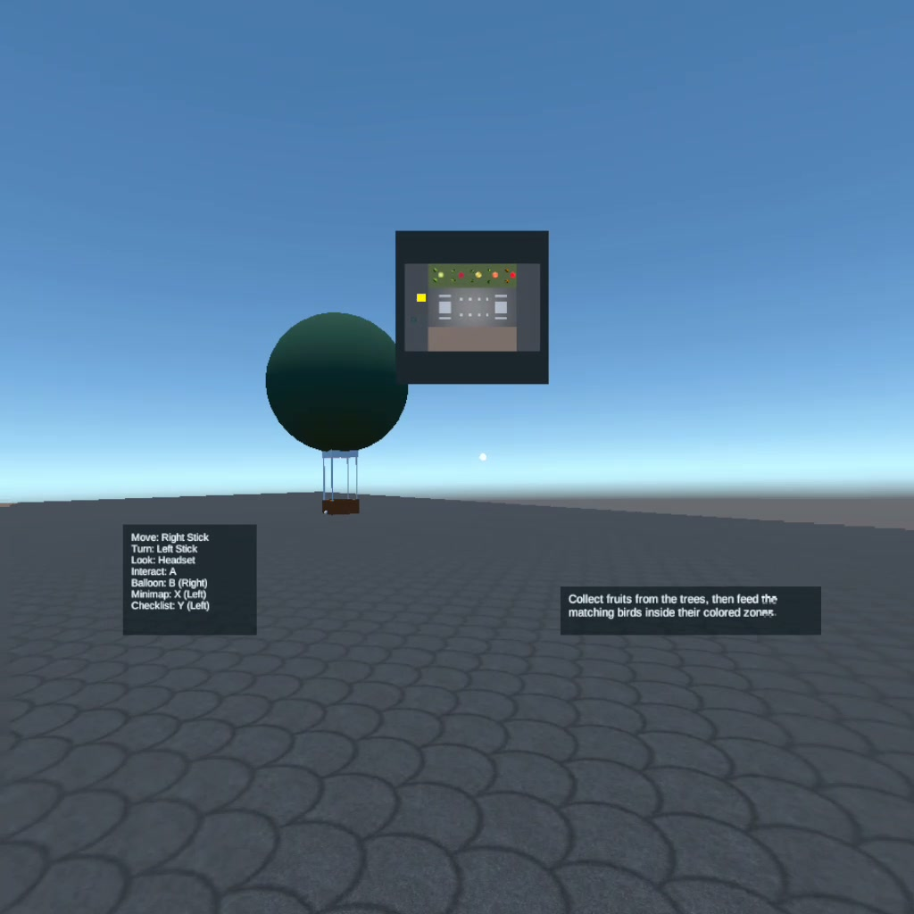

# VR Campus 3DUI Bird Feeding

A Unity XR virtual campus experience demonstrating 3D user interaction techniques, including controller-based navigation, gaze-based fruit collection, animated bird feeding zones, checklist UI, minimap visualization, and hot-air-balloon teleportation.

## Demo Video

[Watch Full Video on YouTube](https://youtu.be/-i-w0VAhPEY)

## Screenshots

### Fruit Feeding and Checklist Interaction

### Enlarged Minimap Teleport Selection

### Hot-Air-Balloon Minimap

## Features

- First-person VR campus navigation
- Controller-based walking and turning
- Gaze-based fruit collection
- Five fruit types with matching bird-feeding tasks
- Animated birds following looped flight paths
- Colored transparent feeding zones
- Checklist UI that updates as fruits are collected and birds are fed
- Minimap / World-in-Miniature interface
- Hot-air-balloon teleportation using an enlarged minimap
- Visible hands/controllers for immersive interaction

## Controls

| Action | Control |
|---|---|
| Move | Right stick |
| Turn | Left stick |
| Interact / collect / feed / confirm teleport | A / trigger |
| Toggle minimap | X |
| Toggle checklist | Y |
| Board / exit hot-air balloon | B |

## Project Setup

Unity version: see `ProjectSettings/ProjectVersion.txt`.

To run the project:

1. Clone the repository.
2. Open the project in Unity.
3. Load `Assets/Scenes/MainScene.unity`.
4. Run with a Meta Quest / Oculus-compatible XR setup.

## Project Overview

This prototype explores spatial interaction patterns for VR: navigating a compact virtual campus, collecting objects through gaze-based selection, tracking progress through diegetic UI, and using a World-in-Miniature minimap for teleportation. The main interaction loop asks the player to collect fruits from trees and feed matching birds inside colored feeding zones.

## Tech Stack

- Unity
- C#
- Unity XR Interaction Toolkit
- Oculus / Meta Quest XR support

## Asset Credits

Downloaded assets include low-poly trees, fruits, birds, materials, and Oculus/XR packages. Add exact source links here before publishing if required by the asset licenses.
